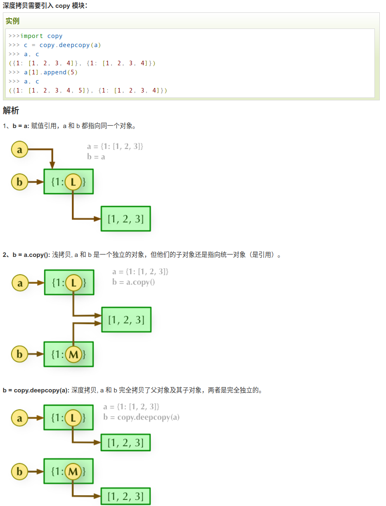

# 拷贝与赋值

## 对象的深拷贝和浅拷贝以及直接赋值
* 直接赋值相当于对象的引用，浅拷贝则指向了两个对象共同的子内存区域，深拷贝则是指向了两个不同的内存区域



```python
#!/usr/bin/python
# -*-coding:utf-8 -*-
 
import copy
a = [1, 2, 3, 4, ['a', 'b']] #原始对象
 
b = a                       #赋值，传对象的引用
c = copy.copy(a)            #对象拷贝，浅拷贝
d = copy.deepcopy(a)        #对象拷贝，深拷贝
 
a.append(5)                 #修改对象a
a[4].append('c')            #修改对象a中的['a', 'b']数组对象
 
print( 'a = ', a )
print( 'b = ', b )
print( 'c = ', c )
print( 'd = ', d )
```

## deepcopy深度复制，是完全复制然后变成一个新的对象，字典数据类型的copy函数，但是当添加，删除等修改操作的时候，两者之间会相互影响
[执行程序](./src/deepcopy_test.py)

* [深拷贝和浅拷贝](https://www.runoob.com/w3cnote/python-understanding-dict-copy-shallow-or-deep.html)


## 参考链接
* 1 [深拷贝和浅拷贝](https://blog.csdn.net/qq_26442553/article/details/82218403)
* 2 [深拷贝和浅拷贝](https://blog.csdn.net/qq_32907349/article/details/52190796)
* 3 [通俗易懂讲解对象的赋值、深拷贝、浅拷贝知识](https://www.runoob.com/w3cnote/python-understanding-dict-copy-shallow-or-deep.html)


