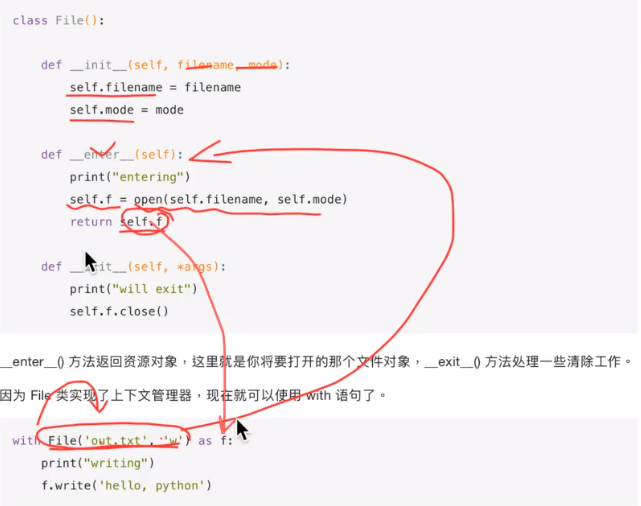
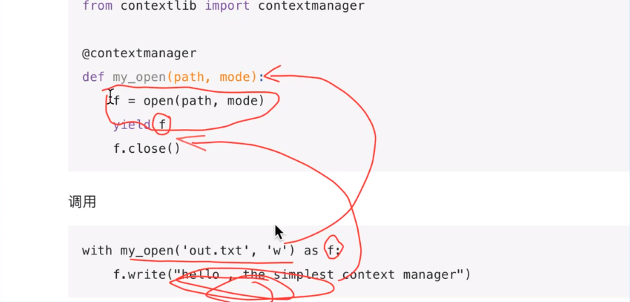

# context上下文管理
## 上下文管理器原理
* 任何实现了 `enter()` 和 `exit()` 方法的对象都可称之为上下文管理器，上下文管理器对象可以使用`with`关键字。
`enter()` 方法返回资源对象，这里就是你将要打开的那个文件对象，`exit()` 方法处理一些清除工作。
因为 `File` 类实现了上下文管理器，现在就可以使用 with 语句了。  


```python
class File():

    def __init__(self, filename, mode):
        self.filename = filename
        self.mode = mode

    def __enter__(self):
        print("entering")
        self.f = open(self.filename, self.mode)
        return self.f

    def __exit__(self, *args):
        print("will exit")
        self.f.close()
```

```python
with File('out.txt', 'w') as f:
    print("writing")
    f.write('hello, python')
```

## contextmanager使用
* Python 还提供了一个 contextmanager 的装饰器，更进一步简化了上下文管理器的实现方式。  
  通过 yield 将函数分割成两部分，yield 之前的语句在 enter 方法中执行，yield 之后的语句在 exit 方法中执行。  
  紧跟在 yield 后面的值是函数的返回值。
  * 使用@contextlib装饰器
  
```python
from contextlib import contextmanager

@contextmanager
def my_open(path, mode):
    f = open(path, mode)
    yield f
    f.close()
```
```python
with my_open('out.txt', 'w') as f:
    f.write("hello , the simplest context manager")
```
* 以`my_open`函数为例来说明上下文管理的使用，当代码`with my_open('out.txt', 'w')`被执行时，
  相当于去执行了函数`my_open`中`yield f`之前的代码，之后把`yield f`的返回值赋值给
  `with my_open('out.txt', 'w') as f:`中的`f`，然后再去执行`f.write("hello , the simplest context manager")`代码
  不管在执行`f.write("hello , the simplest context manager")`这段代码中发生了什么错误，或者这段代码被正常执行完毕以后，
  则跳到函数`my_open`定义的`yield f`之后的代码。

## 参考链接
* 1 [context上下文管理](https://www.daimajiaoliu.com/daima/7120f19206c1c09)
* 2 [context上下文管理授课视频](https://www.bilibili.com/video/BV1v441147Y7?from=search&seid=7448819180147043550&spm_id_from=333.337.0.0)
