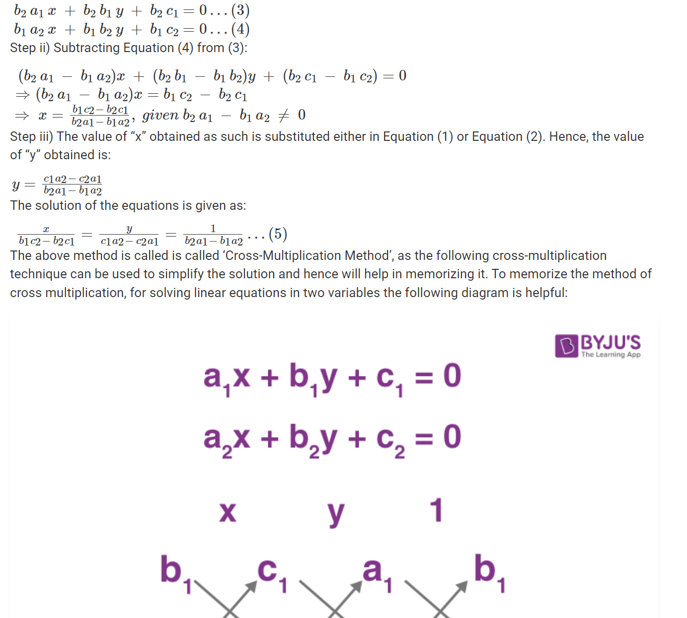

# `numpy`数值计算模块教程

## 计算两条线段或者两条直线是否相交以及交点坐标
* 根据交叉相乘或者消元替换法求解交点坐标
* [交叉相乘法原理以及求解流程](https://byjus.com/maths/cross-multiplication-solving-linear-equation-two-variables/)

* 使用交叉相乘算法求解案例，参考[`lineIntersectionTest`](src/lineIntersectionTest.py)

## 参考链接
* 1 [交叉相乘法原理以及求解流程](https://byjus.com/maths/cross-multiplication-solving-linear-equation-two-variables/)
